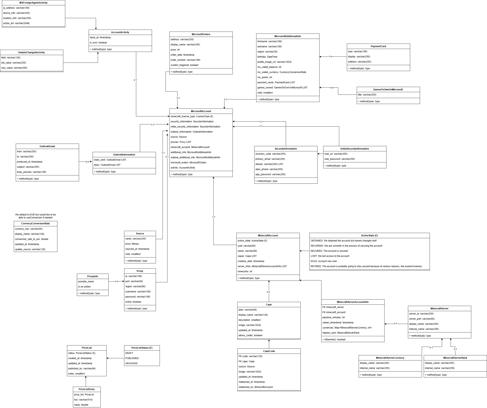

# MSnap Docs

Design MSnap v2:

### ChatGPT Feedback

Stop modeling “Maps inside an entity” for holdings
In your UML you have things like currencies: `Map<MinecraftServerCurrency, int>`. JPA can technically map maps, but it turns into pain fast. Better:
 - `account_server_currency_holding(account_server_info_id, currency_id, amount)`
 - `account_server_item_holding(account_server_info_id, item_id, amount)`
 - rank as `account_server_rank(account_server_info_id, rank_id)` or a column on `MinecraftServerAccountInfo`

&copy; 2026 MSnap